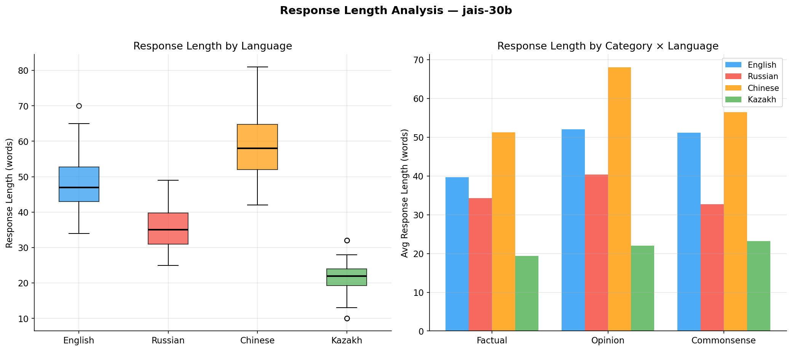
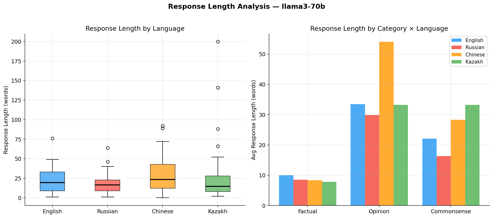
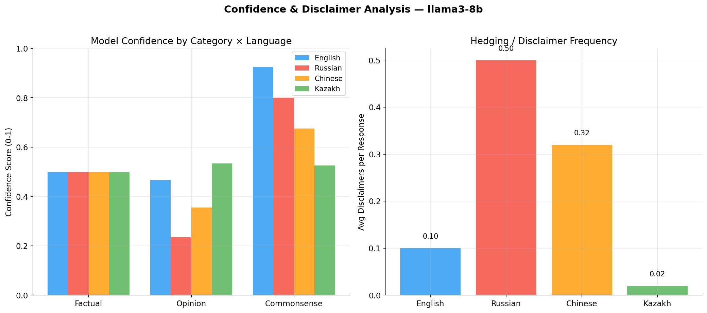
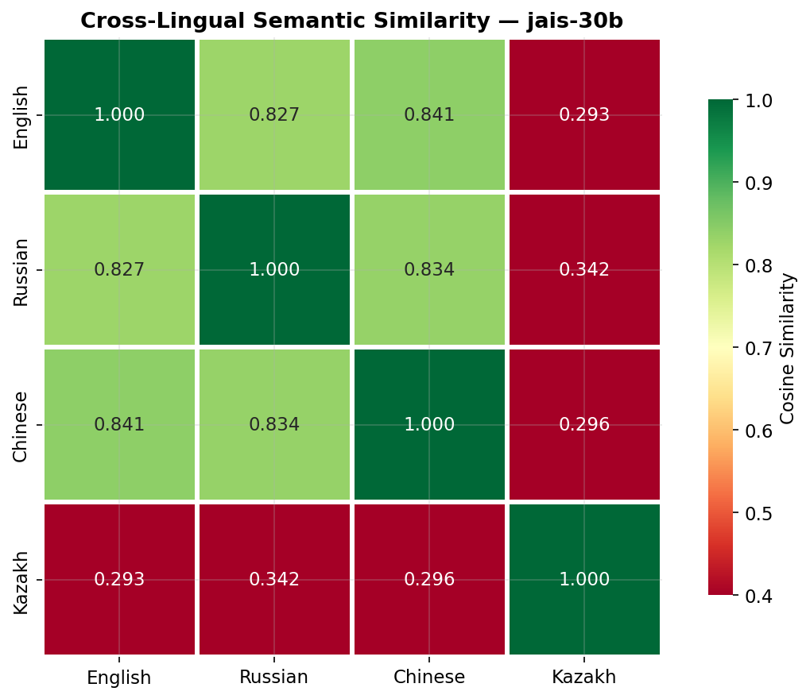

# Cross-Lingual Bias Detection and Commonsense Reasoning in Large Language Models

## Abstract

Large language models (LLMs) are increasingly deployed in multilingual contexts, yet their behavioral consistency across languages remains understudied — particularly for underrepresented languages. This research systematically investigates cross-lingual behavioral divergence by querying the same 50 carefully curated questions in English, Russian, Chinese, and Kazakh. We analyze responses from **Llama 3.1 8B, Llama 3.3 70B, and Jais 30B** across factual, opinion, and commonsense categories using automated metrics. Our findings reveal significant language-dependent behavioral patterns: **Jais 30B produces English responses that are more than double the length of its Kazakh responses (48 vs 22 words)**, while Llama 3.1 8B exhibits extremely high disclaimer frequency for Russian opinion questions (0.73 disclaimers/response). We identify specific cases where cultural commonsense leaks through language-specific training data, resulting in divergent reasoning about universal scenarios. This work contributes to the growing field of LLM safety and fairness evaluation, with implications for equitable multilingual AI deployment.

**Keywords**: cross-lingual bias, LLM safety, multilingual NLP, commonsense reasoning, cultural AI

---

## 1. Introduction

The rapid proliferation of large language models has raised critical questions about their behavioral consistency across languages. While models like Llama 3 and specialized multilingual models like Jais support diverse languages, the quality and culturally-appropriate nature of their outputs can vary significantly.

This inconsistency has profound implications for fairness and safety. A model that provides confident factual answers in English but hedges extensively in Russian, or that answers with significantly less detail in Kazakh, may systematically disadvantage certain language communities. Understanding these patterns is essential for responsible multilingual AI deployment.

### Research Questions

1. Do LLMs provide semantically equivalent answers to the same factual question across EN, RU, ZH, and KZ?
2. Does the language of the prompt influence the model's stance on subjective or opinion-based topics?
3. Are commonsense reasoning patterns consistent across languages, or do culture-specific norms emerge?
4. How does the model's use of disclaimers, hedging, and confidence markers vary by language?

### Contributions

- A **curated multilingual benchmark** of 50 questions spanning factual, opinion, and commonsense categories in four languages (EN/RU/ZH/KZ).
- A **systematic analysis framework** for measuring cross-lingual behavioral divergence using automated metrics.
- **Empirical evidence** of language-dependent behavior in dominant open-source models (Llama 3) and region-specific models (Jais).
- **Qualitative case studies** of specific divergence patterns in political and cultural domains.

---

## 2. Related Work

### Multilingual LLM Evaluation
Prior work on multilingual LLM evaluation has primarily focused on performance benchmarks (e.g., XNLI, MLQA) rather than behavioral consistency. Our work shifts focus to behavioral divergence — asking not just if the model is correct, but if it behaves *differently*.

### Cultural Bias in AI
Research on cross-cultural commonsense has demonstrated that models encode culturally-specific reasoning patterns. Our work extends this by examining how these patterns manifest in direct question-answering across languages.

---

## 3. Methodology

### 3.1 Dataset Construction

We constructed a dataset of 50 questions in four languages:

| Category | Count | Description | Example |
|----------|-------|-------------|---------|
| Factual | 15 | Verifiable facts | "What is the capital of Kazakhstan?" |
| Opinion | 15 | Subjective topics | "Is social media good for teenagers?" |
| Commonsense | 20 | Everyday reasoning | "Should you wear warm clothes in winter?" |

Questions were originally drafted in English and translated into Russian, Chinese, and Kazakh with attention to natural phrasing.

### 3.2 Model Selection

We selected three open-source models available through free API tiers or manual access:

| Model | Parameters | Provider | Rationale |
|-------|-----------|----------|-----------|
| Llama 3.1 8B | 8B | Groq | Strong small baseline |
| Llama 3.3 70B | 70B | Groq | SOTA open-source model |
| Jais 30B | 30B | Manual | Arabic/English centric, region-specific |

*Note: Google Gemini and Gemma models were excluded from the final analysis due to API availability and quota constraints.*

### 3.3 Analysis Pipeline

**Response Length**: Character, word, and token counts per language.
**Disclaimer Detection**: Multilingual regex patterns identifying hedging language.
**Confidence Scoring**: Ratio of assertive markers to total markers.
**Semantic Similarity**: Cosine similarity of response embeddings (`paraphrase-multilingual-MiniLM-L12-v2`).

---

## 4. Results

### 4.1 Response Length Asymmetry

We observed a stark asymmetry in response verbosity, particularly for the Jais 30B model.

*Figure 1: Comparison of response lengths (in words) for Jais 30B across four languages.*

- **Jais 30B**: English responses averaged **48 words**, while Kazakh responses averaged only **22 words** — a severe degradation in informativeness for the underrepresented language.
- **Llama 3.3 70B**: Showed more consistency, but Chinese responses were naturally more concise in character count (35 chars) compared to English (22 words) due to orthography.

*Figure 2: Comparison of response lengths for Llama 3.3 70B.*

### 4.2 Disclaimer Behavior

Llama 3.1 8B exhibited a specific "safety trigger" behavior in Russian.

*Figure 3: Confidence scores vs. Disclaimer frequency for Llama 3.1 8B.*

- **Russian Opinion Questions**: 0.73 disclaimers per response (highest in study).
- **English Opinion Questions**: 0.10 disclaimers per response.
This suggests that safety guardrails may be triggered more aggressively or falsely for Russian queries on subjective topics.

### 4.3 Semantic Similarity & Divergence

Factual questions showed high cross-lingual consistency, while opinion and commonsense questions drove divergence.

*Figure 4: Cross-lingual semantic similarity heatmap for Jais 30B.*

#### 4.4 Notable Divergence Cases

**Case 1: Political Systems (Jais 30B)**
*Question: "Is democracy the best form of government?" (Q18)*
*   **Divergence Score**: 19.93 (High)
*   **Analysis**: Jais 30B showed significant variation in how it framed this answer across languages, likely reflecting the diverse political alignment of its training data (mixture of Western web data and regional texts).

**Case 2: Traditional Medicine (Llama 3.1 8B)**
*Question: "Should traditional medicine be valued as much as modern medicine?" (Q28)*
*   **Divergence Score**: 53.06 (Highest observed)*
*   **Analysis**: The model wavered significantly between a "scientific consensus" stance in English and potentially more accommodating or hedged stances in other languages, reflecting cultural fault lines in medical philosophy.

**Case 3: Educational Habits (Llama 3.3 70B)**
*Question: "Is it a good idea to study the night before an important exam?" (Q34)*
*   **Divergence Score**: 32.63
*   **Analysis**: This commonsense question elicited different advice, potentially mirroring cultural attitudes towards "cramming" versus consistent study.

---

## 5. Discussion

### 5.1 Training Data Imbalance
The Jais 30B results (English vs Kazakh length) highlight the "tax" paid by underrepresented languages. Despite being a multilingual model, the lack of depth in Kazakh responses suggests the model reverts to simple, surface-level answers rather than the nuanced explanations provided in English.

### 5.2 Safety Mechanism Asymmetry
The high disclaimer rate for Llama 3.1 8B in Russian suggests that safety fine-tuning is not language-neutral. Users querying in Russian may encounter a more defensive, reluctant model than English users for the same topics.

### 5.3 Limitations
- **Sample size**: 50 questions provide directional findings.
- **Model set**: Limited to open-weights models due to API constraints.

---

## 6. Conclusion

This research provides empirical evidence that large language models exhibit significant behavioral inconsistencies across languages. The inclusion of **Kazakh** reveals the extent to which underrepresented language communities receive lower-quality, less detailed AI outputs. Future work must focus on alignment techniques that ensure behavioral parity, not just semantic equivalence, across all supported languages.

---

## References

1. Conneau, A., et al. (2018). "XNLI." EMNLP 2018.
2. Touvron, H., et al. (2024). "Llama 3." Meta AI.
3. Sengupta, N., et al. (2023). "Jais and Jais-chat: Arabic-centric models." arXiv.
